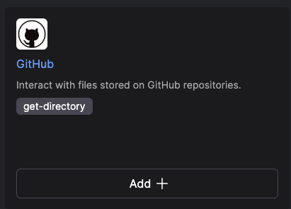
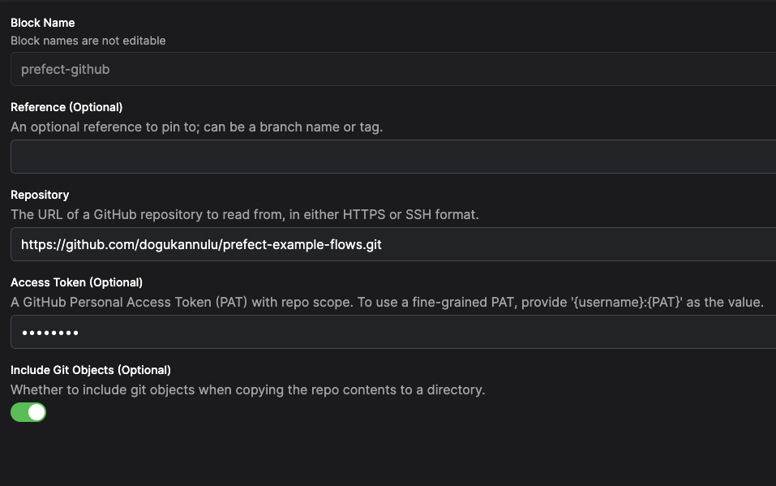
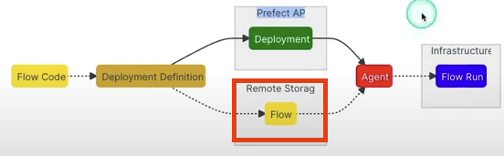

# Instructions

## Tricks (Just mentioning):
- We can use logging for better observability for our flows:
```
from prefect import  get_run_logger

logger = get_run_logger()
logger.info('something to log')
```

- We have two options for deployments:

If we have multiple flows, we can define them in a single Python script. We can use the following commands so that we create multiple deployments for them:

```
first_deployment = first_flow.to_deployment(name="first_deployment", cron = '* * * * *')
second_deployment = second_flow.to_deployment(name="second_deployment", cron = '* * * * *')
serve(first_deployment, second_deployment)
```

Instead of using these, we can use:

```
prefect deployment build <entrypoint>
```


## Steps:

### GitHub Connection:

1. Go to __Blocks__ section and add a new block.
Choose __GitHub__


2. Populate the parameters as below.

Give a desired name to the block
Repository link will be the link we use for `git clone` command
We can use a classic Access token created within __Settings -> Developer Settings -> Personal Access Tokens__

3. After creating the block, don't forget the below commands in the flow script:

```
from prefect.filesystems import GitHub

github_block = GitHub.load("prefect-github")
```

-- Starting from this point, we should follow the steps if we want to create a deployment locally. If not, proceed to __Secret Block__ section

4. While creating the deployment, we will run the command so that Prefect will get the files from our GitHub repository:
`prefect deployment build flows/example-flow.py:testFlow -n example-flow -sb github/prefect-github/flows --apply`

Doing this will help us define the storage block.


5. After doing all these, we have to start the agent.

### Secret Block

1. Go to __Blocks__ section in the Prefect Cloud and create __Secret__ block.
2. Define the block name as `github-access-token`
3. Populate the value with the GitHub access token. 
4. The reason of doing this -> We will use this secret in `prefect.yaml` file

```
pull:
- prefect.deployments.steps.git_clone:
    repository: https://github.com/dogukannulu/prefect-example-flows.git
    branch: main
    access_token: "{{ prefect.blocks.secret.github-access-token }}"
```


### Containerization with Docker

1. Create the `Dockerfile` in the main directory and populate it according to the use case
2. Create a base image with the below command:

```
docker build -t prefect-docker-image .
```

3. Run the container from the base image:

```
docker run -e PREFECT_API_URL=YOUR_PREFECT_API_URL -e PREFECT_API_KEY=YOUR_API_KEY --name prefect-docker-container prefect-docker-image
```

We can obtain the __PREFECT_API_KEY__ from the `API Keys` section of the Prefect Cloud. We can also obtain __PREFECT_API_URL__ by running `prefect config view` command

4. Once we run the container, we will be able to see the Flow Run in Prefect Cloud 👍