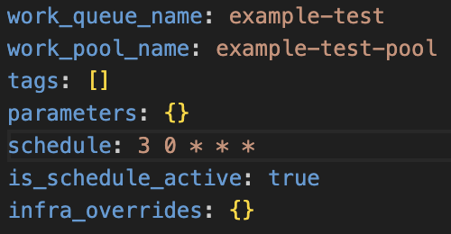

# Instructions

## Steps:

First, we have to access Prefect Cloud by running the below command in the terminal:

```
prefect cloud login
```

Then, we should enable the local machine to be able to work in the Prefect Cloud. After accessing the cloud, we should follow the below steps.

### Secret Block

1. Go to __Blocks__ section in the Prefect Cloud and create __Secret__ block.
2. Define the block name as `github-access-token`
3. Populate the value with the GitHub access token. You can get the access token from the GitHub page __Settings -> Developer Settings -> Personal Access Tokens__
4. The reason of doing this -> We will use this secret in `prefect.yaml` file

```
pull:
- prefect.deployments.steps.git_clone:
    repository: https://github.com/dogukannulu/prefect-example-flows.git
    branch: main
    access_token: "{{ prefect.blocks.secret.github-access-token }}"
```


### GitHub Block:

1. Go to __Blocks__ section and add a new block.
Choose __GitHub__


2. Populate the parameters as below.

Give a desired name to the block
Repository link will be the link we use for `git clone` command
We can use a classic Access token created within __Settings -> Developer Settings -> Personal Access Tokens__

3. After creating the block, don't forget the below commands in the flow script:

```
from prefect.filesystems import GitHub

github_block = GitHub.load("prefect-github")
```

Doing this will help us define the storage block.


5. After doing all these, we have to start the agent.

### Docker Block

1. Create a new Docker container block from the __Blocks__ tab
2. We should include the EXTRA_PIP_PACKAGES as the environmental variable

3. If we want to directly run the flows with a predefined command such as below, we should define the command block accordingly
```
python3 flows/example-flow-2.py
```
4. If not, we should run the below command to create the deployment within the Docker infrastructure and GitHub as the storage block.

First this one to create the work pool `prefect work-pool create 'example-test-pool'`

Then:

```
prefect deployment build flows/example-flow.py:testFlow \
  -n example-flow-deployment \
  -q example-test \
  -sb github/prefect-github \
  -ib docker-container/prefect-docker-container \
  -o example-flow-deployment \
  -p example-test-pool
```

- -n example-flow-deployment specifies the name of the deployment to be example-flow-deployment
- -q example-test the work queue to be example-test
- -sb github/prefect-github specifies the storage to be the github/prefect-github block
- -ib docker-container/prefect-docker-container specifies the infrastructure to be the docker-container/prefect-docker-container block
- -o example-flow-deployment specifies the name of the YAML file to be example-flow-deployment.yaml
- -p example-test-pool specifies the work pool that will handle this deployment's runs

--------- __Add Schedule__ ---------

Above command will create a yaml file `example-flow.deployment.yaml`. We should first update the schedule parameter inside that


Then, we should run the below commands:

```
prefect deployment apply example-flow.deployment.yaml
prefect agent start -p example-test-pool
```

After running all these, we will be able to see the deployment on Prefect Cloud.

5. To add environmental variables for the Docker block, we can define them inside the `Environment` section. For this specific example, I only defined the __EXTRA_PIP_PACKAGES__ env var

### Containerization with Docker

In case we want to create customized Docker agents, we can use this and send the image to Docker Hub but Docker container block is recommended. We can only see the flow run by doing this.

1. Create the `Dockerfile` in the main directory and populate it according to the use case
2. Create a base image with the below command:

```
docker build -t prefect-docker-image .
```

3. Run the container from the base image:

```
docker run -e PREFECT_API_URL=YOUR_PREFECT_API_URL -e PREFECT_API_KEY=YOUR_API_KEY --name prefect-docker-container prefect-docker-image
```

We can obtain the __PREFECT_API_KEY__ from the `API Keys` section of the Prefect Cloud. We can also obtain __PREFECT_API_URL__ by running `prefect config view` command

4. Once we run the container, we will be able to see the Flow Run in Prefect Cloud 👍


## Tricks (Just mentioning):
- We can use logging for better observability for our flows:
```
from prefect import  get_run_logger

logger = get_run_logger()
logger.info('something to log')
```
